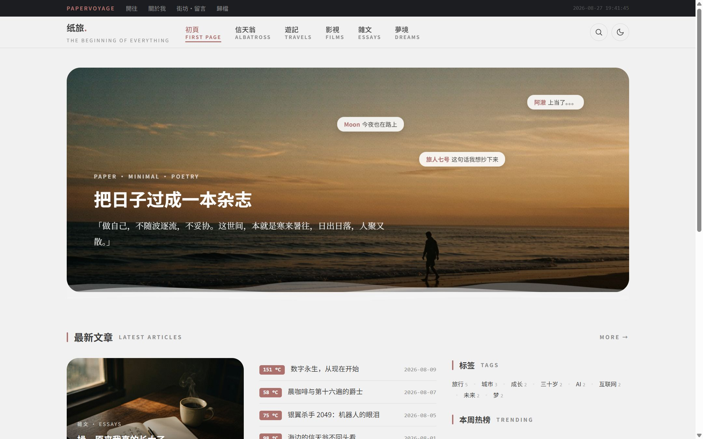
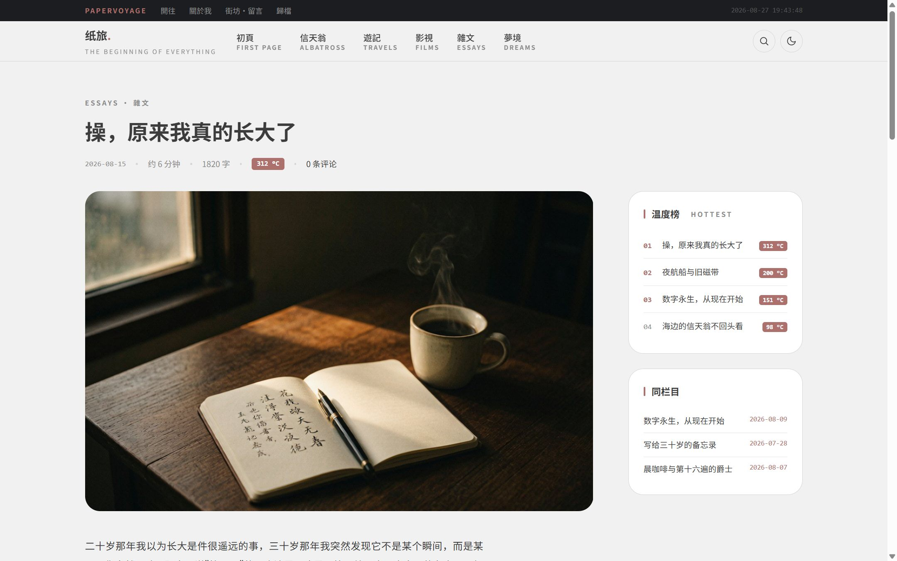
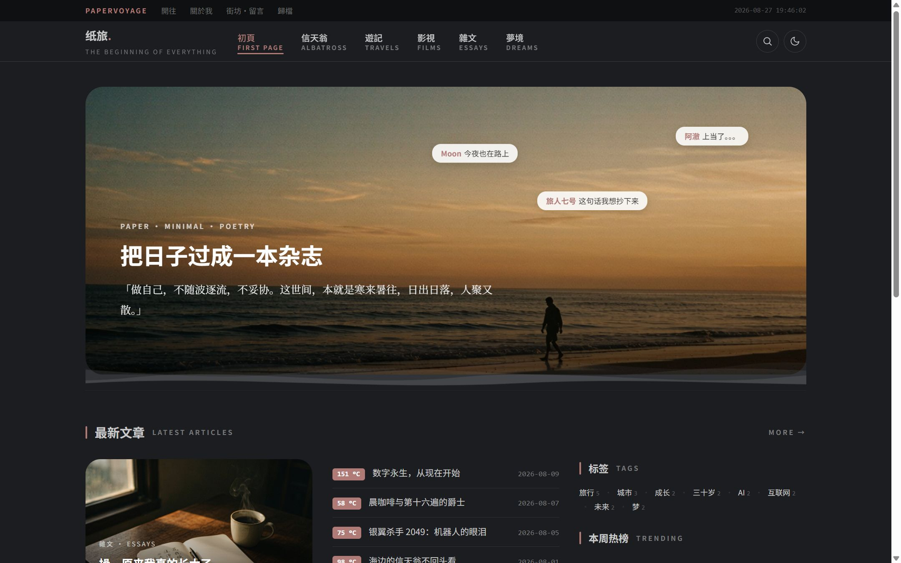
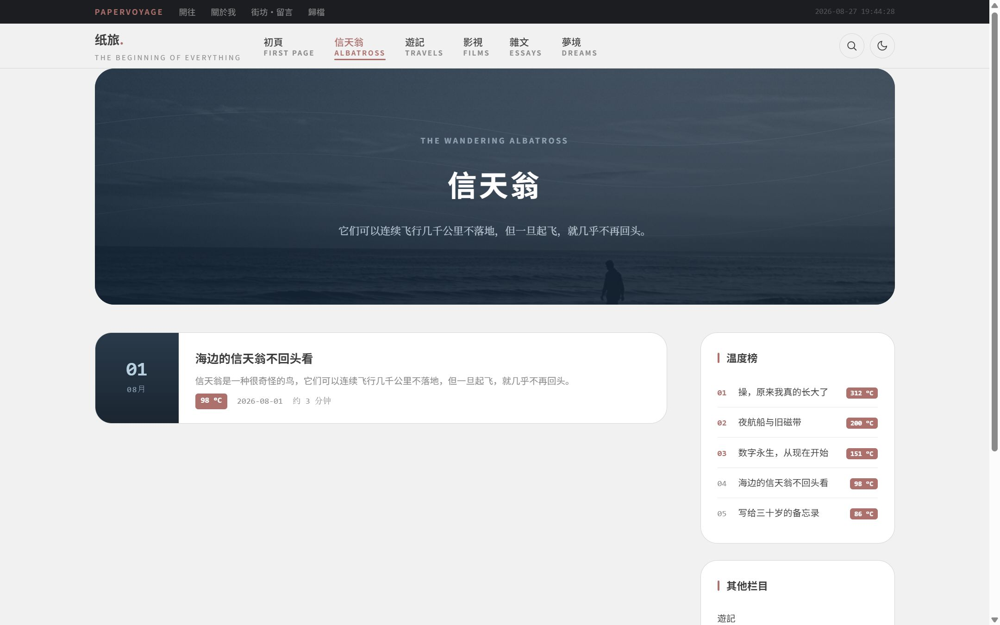
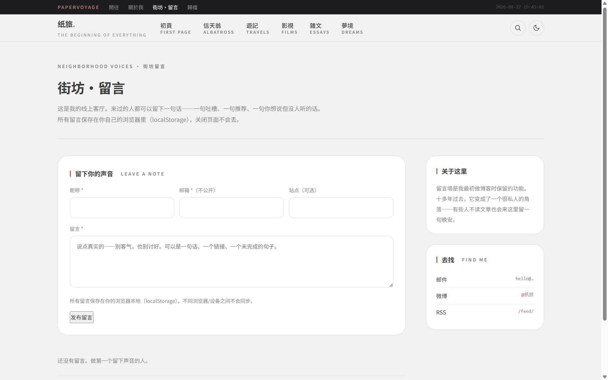

# 纸旅 PaperVoyage

> 纸面极简 × 手作温度 × 数字诗意 —— 一款个人出版型 WordPress 博客主题。

灵感源自孤斗 GUDOU × D.DESIGN 设计系统：纸灰底色、豆沙红单点强调、中英双层排版、「温度 °C」热度隐喻、波浪分隔与取景框引文。支持自定义菜单、特色图片、小工具、明暗双主题。



---

## ✨ 特性

- **五栏目独立视觉** — 初页 / 信天翁 / 随笔 / 游记 / 影视 / 梦境，每个栏目拥有专属 Hero 与卡片风格
- **PJAX 无感切换** — 站内链接零白屏、CSS/JS 零重载，支持前进后退与滚动位置恢复
- **明暗双主题** — 一键切换，纸面画布与暗夜墨色并存
- **温度 °C 系统** — 以温度隐喻热度，给文章一个可触摸的刻度
- **中英双层排版** — 导航、标题、栏目名皆中英并列，杂志感排版
- **评论表单重构** — 昵称/邮箱/站点三字段一行排布，placeholder、必填标记、登录态提示一应俱全
- **分类 Hero 自定义** — 后台为每个栏目上传独立 Hero 大图
- **取景框引文 & 波浪分隔** — 手作温度的细节笔触



## 📐 设计令牌

主题以 CSS 变量统一管控视觉，方便二次定制：

```css
--brand: #ac706d;          /* 豆沙红 · 单点强调 */
--bg: #f1f1f1;              /* 纸灰底色 */
--ink: #3c3c3c;             /* 主文字 */
--font-serif: "Noto Serif SC", ...   /* 衬线 · 标题 */
--font-sans:  "Noto Sans SC", ...    /* 无衬线 · 正文 */
```

## 🗂 项目结构

```
papervoyage/                 # WordPress 主题
├── style.css                # 主题头 + 全部样式
├── functions.php            # 主题功能注册
├── front-page.php           # 首页
├── single.php               # 文章详情
├── category.php             # 栏目页
├── comments.php             # 评论 / 留言
├── inc/
│   ├── template-functions.php   # 栏目风格映射 / 导航输出
│   └── customizer.php           # 后台自定义器
├── assets/
│   ├── js/pjax.js          # PJAX 无感切换
│   └── img/                # 栏目卡片图 / 默认 Hero
└── screenshot.png           # 后台主题缩略图

demo/                        # 纯静态演示（无需 WordPress 即可预览）
├── index.html              # 直接浏览器打开
├── article.html?slug=...   # 文章详情演示
└── category-*.html          # 各栏目演示

build-theme-zip.ps1          # 打包发布 zip
papervoyage-1.4.2.zip        # 当前发布包
```

## 🚀 快速开始

### 方式一：直接预览演示

无需 WordPress，浏览器打开即可看效果：

```bash
# 任意静态服务器即可
cd demo && python -m http.server 8000
# 访问 http://localhost:8000
```

或直接双击 `demo/index.html`。

### 方式二：安装到 WordPress

1. 下载 [`papervoyage-1.4.2.zip`](papervoyage-1.4.2.zip)
2. WordPress 后台 → 外观 → 主题 → 上传主题 → 选择 zip → 安装并启用
3. 后台 → 外观 → 自定义：配置站点标题、菜单、栏目 Hero 图等

## 🎨 更多预览

<p align="center">
  
  
</p>
<p align="center">
  
</p>

## 📜 更新历史

### v1.4.2（2026-08-26）

- **新增** 分类 Hero 图片上传（后台媒体库选择器）
- **新增** 拼音 slug → 栏目风格映射（中文分类兼容）
- **新增** 导航英文副标题内置兜底映射
- **改进** 评论表单全面重构（三字段一行、placeholder、登录态、Cookie 选项）
- **修复** 导航当前高亮扩展至父级 / 祖先菜单项

### v1.4.1（2026-08-26）

发布构建脚本 `build-theme-zip.ps1`。

### v1.4.0（2026-08-22）

PJAX 无感切换 + 过渡动画 + CLS / 白屏修复。详见 [`papervoyage/CHANGELOG.md`](papervoyage/CHANGELOG.md)。

## 🔧 技术栈

- WordPress 5.8+ / PHP 7.4+
- 原生 CSS 变量 + Grid/Flex 布局
- PJAX + View Transitions API + Speculation Rules 预取
- 明暗双主题（localStorage 持久化）

## 📄 协议

GPL-2.0-or-later，与 WordPress 主题生态一致。

---

<p align="center">
  <em>把日子，过成一本杂志。</em>
</p>
